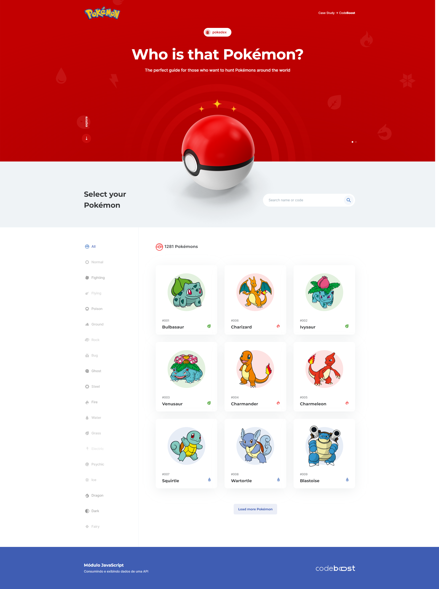

Landing Page desenvolvido no curso Codeboost que nos desafiou a criar um interface trabalhando com API, onde fornece todas as informações referente ao universo de pokemon.

Reforçamos todos os conhecimentos adquiridos até aqui e aumentando o nivel de dificuldade colocando os alunos em um ambiente desafiador e real.
## Screenshots

## Funcionalidades

- Slide com fade in (Swiper.js)
- Axios para fazer a leitura da API e integração
- Modal para detalhes do pokemon
- Multiplataforma
- Barra de pesquisa
- Categoria dos pokemons
## Stack utilizada

**Front-end:** HTML, CSS/SASS, Gulp, JS e bibliotecas

**Back-end:** Axios, JSON, Pokeapi.co

## Autores & Criador

- [@WillMoreiraDev](https://github.com/WillMoreiraDev)

## 🔗 Links

